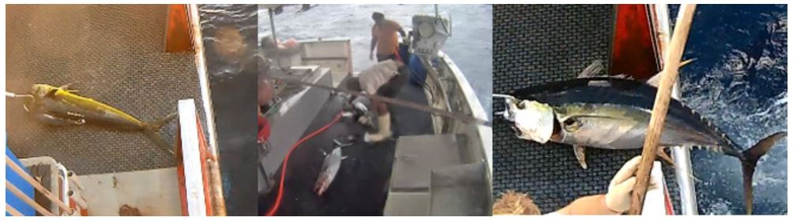

# Final project: The Nature Conservancy Fisheries Monitoring

## Introduction

Nature Conservancy Fisheries Monitoring competition inviting the Kaggle community to develop algorithms to automatically detect and classify species of tunas, sharks and more that fishing boats catch, which will accelerate the video review process. Faster review and more reliable data will enable countries to reallocate human capital to management and enforcement activities which will have a positive impact on conservation and our planet.

## Dataset

### Training data
Eight target categories are available in this dataset: Albacore tuna, Bigeye tuna, Yellowfin tuna, Mahi Mahi, Opah, Sharks, Other (meaning that there are fish present but not in the above categories), and No Fish (meaning that no fish is in the picture). Each image has only one fish category, except that there are sometimes very small fish in the pictures that are used as bait. 
### Testing data
There are two stage testing data, 1st stage dataset's distribution is similar to training dataset (ex: similar backround, boat, person...), but 2nd stage dataset's distribution is different from training dataset, which contains different background or boat in the image. 

## Model
In this competition, we tried three different classification model:
- [FFVT](https://arxiv.org/abs/2107.02341)
- [TransFG](https://arxiv.org/abs/2103.07976)
- [VIT](https://arxiv.org/abs/2010.11929).

We try different hyper-parameter setting on each model, and aim to find the suitable setting.
